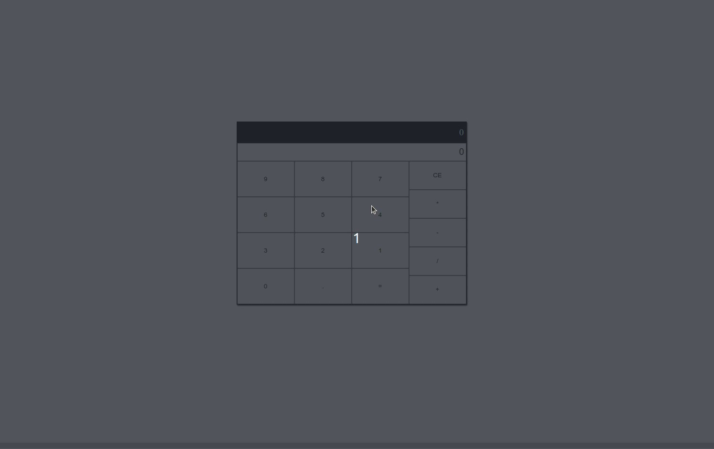

#  Calculator App 



<h2>🌐</h2>
<ul>
  <li><a href="https://github.com/SamuelRocha91/calculator" target="_blank">Português</a></li>
  <li><a href="https://github.com/SamuelRocha91/calculator/blob/main/README_es.md" target="_blank">Español</a></li>
  <li><a href="https://github.com/SamuelRocha91/calculator/blob/main/README_en.md" target="_blank">English</a></li>
  <li><a href="https://github.com/SamuelRocha91/calculator/blob/main/README_ru.md" target="_blank">Русский</a></li>
  <li><a href="https://github.com/SamuelRocha91/calculator/blob/main/README_ch.md" target="_blank">中文</a></li>
  <li><a href="https://github.com/SamuelRocha91/calculator/blob/main/README_ar.md" target="_blank">العربية</a></li>
</ul>

## Overview

This is a beginner project developed as part of the **Fundamentals** module of the **Web Development** course at Trybe. The primary goal was to create a simple calculator application using **React**, **JavaScript**, **CSS**, and **HTML**. The project involved manipulating `script.js`, `index.html`, and `style.css` files.

## Features

The application allows users to:

- **Perform basic arithmetic operations**: Addition, subtraction, multiplication, and division.
- **Clear input**: Reset the calculator to the initial state.
- **Handle decimal points**: Add decimal points to numbers.
- **Calculate results**: Display the result of the arithmetic operation.

## Skills Developed

During the development of this project, the following skills were enhanced:

1. Manipulating **DOM elements** using React.
2. Implementing **state management** with React hooks.
3. Applying **programming logic** to handle user inputs and operations.
4. Utilizing **event handling** for user interactions.
5. Using **conditional statements** and **loops** to manage application logic.
6. Writing **modular functions** to maintain and manage the code effectively.

## Other Beginner Projects

Here are other projects I developed during the early stages of my development journey:

- [Project 1](#) – Brief description of the project.
- [Project 2](#) – Brief description of the project.
- [Project 3](#) – Brief description of the project.

## How to Run

1. Clone this repository:
   ```bash
   git clone https://github.com/SamuelRocha91/memeGenerator.git
   ```
2. Navigate to the project directory:
   ```bash
   cd memeGenerator
   ```
3. Install dependencies:
   ```bash
   npm install
   ```
4. Start the development server:
   ```bash
   npm run dev
   ```
5. Open your browser and go to `http://localhost:3000` to see the application in action.

---
