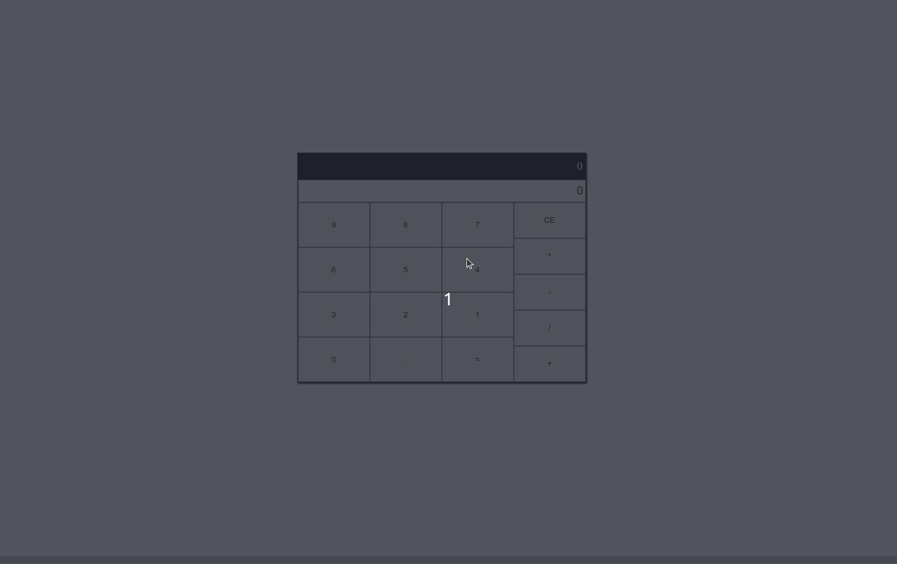

#  Aplicación de Calculadora 



## 🌐 
[](https://github.com/SamuelRocha91/calculator/blob/main/README.md) 
[](https://github.com/SamuelRocha91/calculator/blob/main/README_es.md) 
[](https://github.com/SamuelRocha91/calculator/blob/main/README_en.md) 
[](https://github.com/SamuelRocha91/calculator/blob/main/README_ru.md) 
[](https://github.com/SamuelRocha91/calculator/blob/main/README_ch.md) 
[](https://github.com/SamuelRocha91/calculator/blob/main/README_ar.md)

<details>
<summary><h2>Visión General</h2></summary>

Este es un proyecto inicial desarrollado como parte del módulo de **Fundamentos** del curso de **Desarrollo Web** de Trybe. El objetivo principal fue crear una aplicación de calculadora simple usando **React**, **JavaScript**, **CSS** y **HTML**. El proyecto implicó la manipulación de los archivos `script.js`, `index.html` y `style.css`.

</details>

<details>
<summary><h2>Funciones</h2></summary>

La aplicación permite a los usuarios:

- **Realizar operaciones aritméticas básicas**: Adición, sustracción, multiplicación y división.
- **Limpiar la entrada**: Reiniciar la calculadora a su estado inicial.
- **Trabajar con puntos decimales**: Agregar puntos decimales a los números.
- **Calcular resultados**: Mostrar el resultado de la operación aritmética.

</details>

<details>
<summary><h2>Habilidades Desarrolladas</h2></summary>

Durante el desarrollo de este proyecto, se mejoraron las siguientes habilidades:

1. Manipulación de **elementos del DOM** usando React.
2. Implementación de **gestión de estado** con hooks de React.
3. Aplicación de **lógica de programación** para manejar entradas y operaciones de los usuarios.
4. Utilización de **manejo de eventos** para interacciones del usuario.
5. Uso de **declaraciones condicionales** y **bucles** para gestionar la lógica de la aplicación.
6. Escritura de **funciones modulares** para mantener y gestionar el código de manera eficaz.

</details>

<details>
<summary><h2>Otros Proyectos Iniciantes</h2></summary>

Aquí hay otros proyectos que desarrollé durante las primeras etapas de mi viaje de desarrollo:

- 🖥️ [Conversor de binarios](https://github.com/SamuelRocha91/Bin2Dec/blob/main/README_es.md)
- 🦖 [Generador de memes](https://github.com/SamuelRocha91/memeGenerator/blob/main/README_es.md)
- 🎨 [Pixels Art](https://github.com/SamuelRocha91/PixelsArt/blob/main/README_es.md)
- 📝 [Lista de Tareas](https://github.com/SamuelRocha91/TodoList/blob/main/README_es.md)
- 🪐 [Planetas de Star Wars](https://github.com/SamuelRocha91/javascriptStarWarsPlanets/blob/main/README_es.md)

</details>

<details>
<summary><h2>Cómo Ejecutar</h2></summary>

1. Clona este repositorio:
   ```bash
   git clone https://github.com/SamuelRocha91/calculator.git
   ```
2. Navega al directorio del proyecto:
   ```bash
   cd calculator
   ```
3. Instala las dependencias:
   ```bash
   npm install
   ```
4. Inicia el servidor de desarrollo:
   ```bash
   npm run dev
   ```
5. Abre tu navegador y accede a `http://localhost:3000` para ver la aplicación en funcionamiento.

</details>
